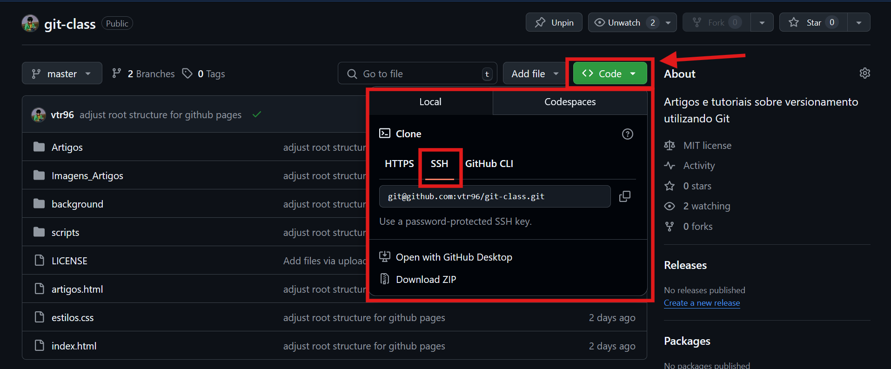
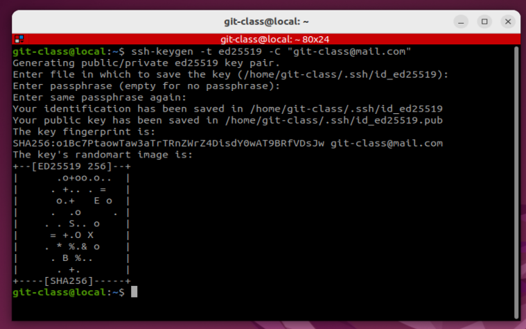
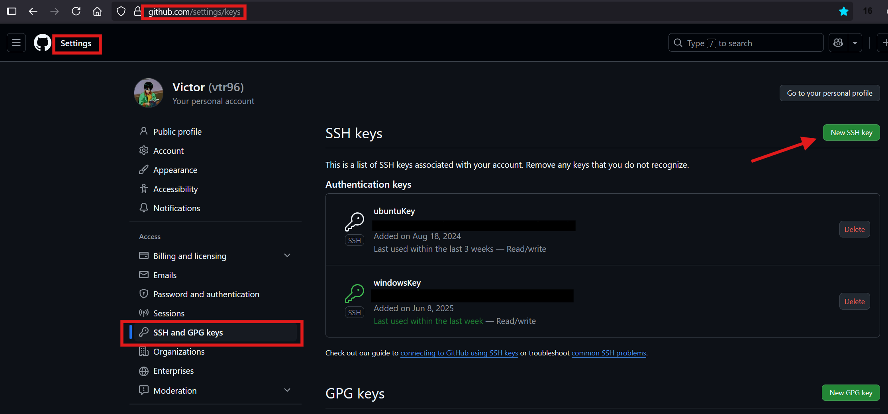
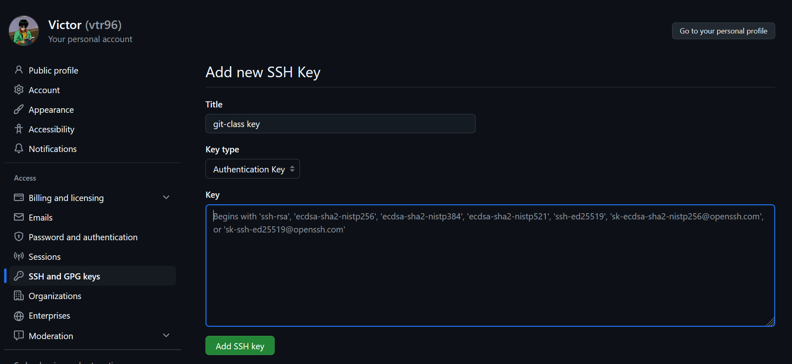

# Autenticação com chave SSH no GitHub

Neste artigo, vamos aprender o que é uma chave SSH, como gerar a sua e usá-la para autenticação ao usar o Git via linha de comando. Também veremos rapidamente a diferença entre o uso de HTTPS e SSH para esse fim.

---

## O que é uma chave SSH?

SSH (Secure Shell) é um protocolo que permite uma conexão segura entre seu computador e um servidor remoto. No caso do GitHub, usamos SSH para nos autenticar sem precisar digitar login e senha toda vez que interagimos com o repositório via terminal.

Funciona como um "cartão de acesso digital": você gera um par de chaves (uma pública e uma privada). A chave pública é enviada ao GitHub, e a chave privada fica com você — protegida.

<!-- Sugestão de imagem:
Diagrama mostrando o conceito de chave pública e privada
-->

---

## Diferença entre SSH e HTTPS

Ao clonar ou enviar alterações para um repositório Git remoto, você pode usar dois protocolos principais: HTTPS ou SSH.

| Protocolo | Autenticação             | Recomendado para                       |
|-----------|--------------------------|----------------------------------------|
| HTTPS     | Login e senha (ou token) | Acesso rápido e sem configuração inicial |
| SSH       | Chave pública/privada    | Uso frequente com terminal e maior segurança |

Com HTTPS, você pode ser solicitado a digitar usuário/senha ou token em cada operação. Com SSH, uma vez configurado, o acesso é automático e seguro.



---

## Como gerar sua chave SSH

1. Abra o terminal e digite:

```bash
ssh-keygen -t ed25519 -C "seu-email@exemplo.com"
```

Se sua máquina não suportar ed25519, use rsa:

```bash
ssh-keygen -t rsa -b 4096 -C "seu-email@exemplo.com"
```

2. Pressione Enter para aceitar o caminho padrão: `~/.ssh/id_ed25519`
3. Defina (ou não) uma passphrase para proteção extra



---

## Adicionando sua chave ao agente SSH

1. Inicie o agente SSH:

```bash
eval "$(ssh-agent -s)"
```

2. Adicione sua chave privada:

```bash
ssh-add ~/.ssh/id_ed25519
```

---

## Adicionando a chave pública ao GitHub

1. Copie o conteúdo da chave pública:

```bash
cat ~/.ssh/id_ed25519.pub
```

2. Vá até GitHub > Settings > SSH and GPG keys e clique em “New SSH key”


3. Dê um título de sua preferência, cole a chave pública e clique em "Add SSH key"


---

## Testando sua conexão

Execute:

```bash
ssh -T git@github.com
```

Se tudo estiver certo, o terminal exibirá uma mensagem como:
> Hi usuário! You've successfully authenticated...

---

## Conclusão

O uso de chaves SSH facilita a vida de quem trabalha com Git via linha de comando. É seguro, automatizado e ideal para quem contribui regularmente com projetos.
