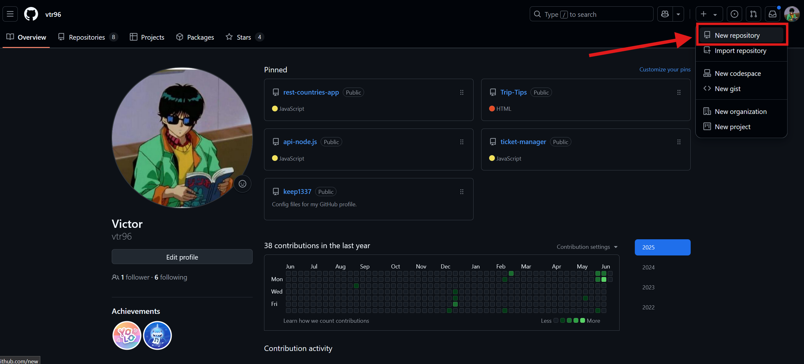

# 📘 Como Criar um Repositório no GitHub

Este artigo ensina, passo a passo, como criar um novo repositório no GitHub, assumindo que você já tem uma conta criada na plataforma.
<!--img-placeholder:
Capa do artigo
-->
---

## 🔐 1. Acesse sua conta no GitHub

Primeiramente, acesse o site do GitHub:

[https://github.com](https://github.com)

Se necessário, faça login com seu usuário e senha.

<!--img-placeholder:
Tela de login do GitHub ou página inicial logado
-->

---

## ➕ 2. Criar um novo repositório

No canto superior direito da tela, clique no ícone de **"+"** e selecione a opção **"New repository"**.

---

## 📝 3. Preencha as informações do repositório

Você será redirecionado para uma página com um formulário. Preencha os seguintes campos:

- **Repository name**: Escolha um nome para seu projeto (ex: `meu-projeto-git`)
- **Description** (opcional): Descreva brevemente o propósito do repositório
- **Visibility**:
    - `Public`: qualquer pessoa pode visualizar
    - `Private`: apenas você ou membros autorizados

**Recomendações:**
✅ Marque a opção **“Add a README file”**  
✅ Opcionalmente, adicione um `.gitignore` se souber a linguagem que vai usar  
✅ Também pode escolher uma licença, como MIT ou GPL

<!--img-placeholder:
Formulário preenchido com exemplos de nome, descrição, e opções marcadas
-->

---

## 🚀 4. Clique em "Create repository"

Depois de preencher tudo, clique no botão verde **"Create repository"**.

Pronto! Seu repositório foi criado com sucesso.

<!--img-placeholder: Página de repositório-->

## 🎬 Tutorial em Vídeo

<iframe width="1170" height="610" 
        src="https://www.youtube.com/embed/VSYMJKHdKOs" 
        frameborder="0" 
        allow="accelerometer; autoplay; clipboard-write; encrypted-media; gyroscope; picture-in-picture" 
        allowfullscreen>
</iframe>
